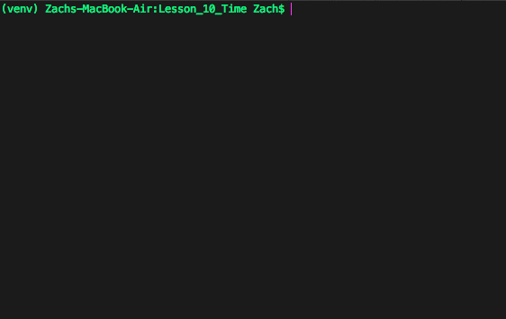

# Python Lesson 10 - Logic and Time

[All Lessons](https://zsiegel92.github.io/Eitan_S/)

[TOC]

## Logic: `and` and `or`

### Conditional Expressions and Conditional Constructs

**Conditional expressions** are expressions that evaluate to \\(True\\) or \\(False\\). In Python, \\(True\\) statements evaluate to `True` and \\(False\\) statements evaluate to `False`. Variables that store the values `True` and `False` are called **boolean variables** and their `type` is `bool`.

```python
>>> x = (4 < 5)
>>> x
True
>>> type(x)
<class 'bool'>
```

Here are some **conditional expressions** in Python using different operators (like `<=`, `==`, and `in`):

|Evaluate to `True`|Evaluate to `False`|
|---|---|
|`4 < 5`|`5 < 4`|
|`6 >= 4`|`4 >= 6`|
|`'hello' == 'hello'`|`'hello' == 'hi'`|
|`2 in [1,2,3,4,5]`|`2 in [5,6,7]`|

**Conditional constructs** are commands that either execute or do not execute, based on the value of a **conditional expression**.

We have seen **conditional expressions** in the following **conditional constructs**:

* `if`-`elif`-`else`:
	```python
	x = 6
	if x < 5:
		print("I do not have enough money for a taco")
	elif x == 5:
		print("I have exactly enough money for a taco")
	else:
		print("I do not have enough money for a taco")
	```
* `while`:
	```python
	x = 0
	while x < 5:
		print(x)
		x = x + 1
	```
###Logical Operators `and` and `or`

**Before making decisions, humans evaluate many, many different conditional statements.** Sometimes, all the conditions have to be a certain way; other times, just some of the conditions have to be right.

For example:

```
if (I am hungry) and (I have enough money), or if (free tacos are provided at school),
	I will eat a taco.
Otherwise, if (I am hungry) and (I have an apple in my backpack),
	I will eat an appple.
Otherwise,
	I will not eat anything.
```
>**This is NOT Python code!!** This is an attempt to represent human reasoning in English (plus some parentheses). Note that the word "if" serves the same purpose in English as it does in Python; the words "Otherwise, if" serve the same purpose as `elif` in Python; the word "Otherwise" on its own serves the same purpose as `else` in Python.

*Notice the use of **and** and **or** in our conditional construct!* We can achieve the same thing in Python:

<iframe height="400px" width="100%" src="https://repl.it/@ZSiegel/Logicandor?lite=true" scrolling="no" frameborder="no" allowtransparency="true" allowfullscreen="true" sandbox="allow-forms allow-pointer-lock allow-popups allow-same-origin allow-scripts allow-modals"></iframe>

>Try changing the values of `hungry`, `money`, `free_tacos` and `backpack_apple`, and try to achieve each of the possible outcomes!

#### `and` and `or` are "Operators"

*The keywords `and` and `or` are **operators** in Python, meaning they transform expressions into a new expression.* Specifically, `and` and `or` combine two `bool` expressions into one `bool` expression:

```Python
>>> (4 < 5) or (4 < 3)
True
>>> (4 < 5) and (4 < 3)
False
```

The most straightforward examples are the following:

```Python
>>> True or False
True
>>> True and False
False
>>> True and True
True
>>> True or True
True
>>> False or False
False
```


We have seen the following operators in Python (among a few others):

|Operator|Name|Argument Types|Expression using Operator| Value of Evaluated Expression|Type of Output|
|---|---|---|---|---|---|
|`+`|Arithmetic Addition|`int` and `int` (or `float` and `float`)| `5 + 10`| `15`|`int` (or `float`)|
|`+`|String Concatenation|`str` and `str`|`'hey' + ' my friend'`| `'hey my friend'`|`str`|
|`+`| List Concatenation|`list` and `list`|`[1,2,3] + [4,5]` | `[1,2,3,4,5]`|`list`|
|`in`|Substring Operator|`str` and `str` | `'a' in 'blah blah'`|`True`|`bool`|
|`in`|List Containment Operator|(any type) and `list`|`5 in [2,3,4,5]`|`True`|`bool`|
|`*`|Arithmetic Multiplication| `int` and `int` (or `float` and `float`) | `6*5`| `30` | `int` (or `float`)|
|`and`| Logical And|`bool` and `bool`|`(4<5) and (5<6)`|`True`|`bool`|
|`or`|Logical Or| `bool` and `bool`|`(4<5) or (4>5)`|`True`|`bool`|

>Note that some symbols (`+` and `in`, for example) correspond to different operators based on the **type** of the arguments! These are called "overloaded" operators, and in Python, we can further overload those operators with new functionality if we want to!

## Time: `time.sleep`

Much of the technology around us deals with time in some way:

* digital clocks
* calendars
* movies: normal speed, fast-forward, and slow motion
* games: actions take a certain amount of time


Let's build an app that counts to 100 for hide-and-seek players

<iframe height="400px" width="100%" src="https://repl.it/@ZSiegel/Countingnosleep?lite=true" scrolling="no" frameborder="no" allowtransparency="true" allowfullscreen="true" sandbox="allow-forms allow-pointer-lock allow-popups allow-same-origin allow-scripts allow-modals"></iframe>

Unfortunately, Python programs execute code much too quickly to allow us to count like this.

>Try changing `while i < 100` to `while i < 100000`. That will allow some time to pass, but it also will not run smoothly.

**Python will pause for any specified amount of time if we call `time.sleep` from the `time` module.** We have to import the `time` module to use this command, and `time.sleep(x)` will cause Python to pause for `x` seconds.

<iframe height="400px" width="100%" src="https://repl.it/@ZSiegel/Countingtimesleep?lite=true" scrolling="no" frameborder="no" allowtransparency="true" allowfullscreen="true" sandbox="allow-forms allow-pointer-lock allow-popups allow-same-origin allow-scripts allow-modals"></iframe>

## Games that use `input` can be made into movies using `time.sleep`

[Lesson 8](https://zsiegel92.github.io/Eitan_S/Lessons/Lesson_8_Input_and_Challenges/Python8.html) asked you to take user input to give directions to a navigator. Here is what you produced:

<iframe height="400px" width="100%" src="https://repl.it/@ZSiegel/InputNavigationGameSolution?lite=true" scrolling="no" frameborder="no" allowtransparency="true" allowfullscreen="true" sandbox="allow-forms allow-pointer-lock allow-popups allow-same-origin allow-scripts allow-modals"></iframe>

[Lesson 9](https://zsiegel92.github.io/Eitan_S/Lessons/Lesson_9_Sorting/Python9.html) introduced the `random.choice` function, which produces a random value from the elements of a list:

```python
>>> import random
>>> random.choice(['hi','hello','sup?'])
'hi'
>>> random.choice(['hi','hello','sup?'])
'sup?'
>>> random.choice(['hi','hello','sup?'])
'hello'
>>> random.choice(['hi','hello','sup?'])
'sup?'
>>> random.choice(['hi','hello','sup?'])
'hi'
```

Using `random.choice` and `time.sleep`, we can turn our game into a movie:

<iframe height="400px" width="100%" src="https://repl.it/@ZSiegel/InputNavigationGameMovie?lite=true" scrolling="no" frameborder="no" allowtransparency="true" allowfullscreen="true" sandbox="allow-forms allow-pointer-lock allow-popups allow-same-origin allow-scripts allow-modals"></iframe>


>Try changing `time.sleep(0.1)` to `time.sleep(0.001)` to see the game run faster!

>This game runs until the player reaches \\((10,8)\\), but with random directions, the player might or might not ever get there!


## Assignments

1. **Logic test!** Change `my_solution` so that this code prints `"All Correct!"`

	<iframe height="400px" width="100%" src="https://repl.it/@ZSiegel/LogicTest?lite=true" scrolling="no" frameborder="no" allowtransparency="true" allowfullscreen="true" sandbox="allow-forms allow-pointer-lock allow-popups allow-same-origin allow-scripts allow-modals"></iframe>

	Save your assignment as `logic_test.py` or fork on repl.it.

2. **Edge Detection!** Make a change to the navigation game so that when a direction is entered, movement is only recorded if `x` and `y` would stay within a certain range.

	Do this by creating a variable called `size`, and, when a direction is given, only change `x` or `y` if they stay between `0` and `size`. For example, if `size` is `10`, then `x` and `y` would have to stay between `0` and `10`. Whether the bounds (`0` and `size`) are valid is up to you (meaning it's okay to restrict to `1` to `9` when `size` is `10`).

	1. When you move to the **left**, make sure `x > 0` (**This requirement is satisfied in the code below!**)
	2. When you move **down**, make sure `y > 0`
	3. When you move **right**, make sure `x < size`
	4. When you move **up**, make sure `y < size`

	<iframe height="400px" width="100%" src="https://repl.it/@ZSiegel/InputNavigationGameMovieBoundsAssignment?lite=true" scrolling="no" frameborder="no" allowtransparency="true" allowfullscreen="true" sandbox="allow-forms allow-pointer-lock allow-popups allow-same-origin allow-scripts allow-modals"></iframe>

	>If you have done your work correctly, then when you play this movie, the treasure will **always** be found, eventually!

	Save your assignment as `navigation_movie_boundaries.py` or fork on repl.it.

3. **Visualization of Movement**

	Below are a `create_board` function and a `pretty_print` function. When `pretty_print(create_board(size,x,y))` is called, a list of lists called `board` will be created and returned by `create_board`, consisting of `size` lists each with `size` elements. In [Lesson 6](https://zsiegel92.github.io/Eitan_S/Lessons/Lesson_6_Lists/Python6.html#two-dimensional-lists), we saw how a list of lists could be visualized as a grid (click the link!). The function `pretty_print` prints the board so that it looks like a grid.

	The square at coordinates \\(x,y\\) will be the element at index `x` of the list at index `y` in `board`.

	<iframe height="400px" width="100%" src="https://repl.it/@ZSiegel/NavigationPrintboard?lite=true" scrolling="no" frameborder="no" allowtransparency="true" allowfullscreen="true" sandbox="allow-forms allow-pointer-lock allow-popups allow-same-origin allow-scripts allow-modals"></iframe>

	Copy these two functions as well as your solution to the previous problem into one file or repl.it environment. Now, on each loop iteration, instead of printing `Moving left!` or `Moving right!`, call `pretty_print(create_board(size,x,y,10,8))`. This will print the board at each loop iteration, so that *you can watch* as the treasure is found.

	Running your code should look similar to this:

	<div style="text-align: center;">
		
		Correct output: Player icon (`O`) should move on its own, and eventually reach the treasure (`X`)
	</div>

