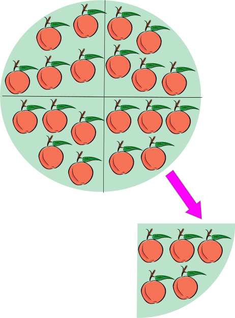
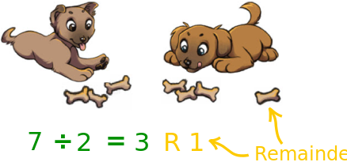
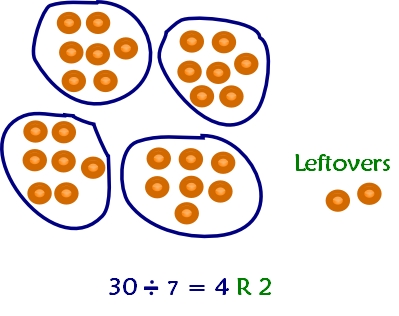

# Python Lesson 12 - Challenges

[All Lessons](https://zsiegel92.github.io/Eitan_S/)

[TOC]

## Randomly Choosing, Avoiding Forbidden Elements

Achashverosh, the King of Persia, wants to randomly choose his next viceroy (his second-in-command). He asks his wife Esther to pick for him by drawing a name from a hat. She is able to do this in private, though, so nobody will see if she puts a name back into the hat.

She decides that if she draws `'Haman'`, she will put it back into the hat. Here is her algorithm:

<iframe height="400px" width="100%" src="https://repl.it/@ZSiegel/Randomforbidden1?lite=true" scrolling="no" frameborder="no" allowtransparency="true" allowfullscreen="true" sandbox="allow-forms allow-pointer-lock allow-popups allow-same-origin allow-scripts allow-modals"></iframe>

>Run this a few times. What names do you get?

When she uses this method, though, she still winds up with `'Haman'`! She realizes that she drew `'Haman'`, put it back in the hat, and then, unfortunately, drew `'Haman'` again!

She decides on a new method:

<iframe height="400px" width="100%" src="https://repl.it/@ZSiegel/Randomforbidden2?lite=true" scrolling="no" frameborder="no" allowtransparency="true" allowfullscreen="true" sandbox="allow-forms allow-pointer-lock allow-popups allow-same-origin allow-scripts allow-modals"></iframe>

>Run this a few times. What names do you get?

This ensures that she will draw a name, over and over, until it is NOT `'Haman'`. Whew.

>Note that `picked == 'Haman'` may never be true, depending on the first call to `random.choice`. That means the *body* of the `while` loop may never execute. That's just fine. This code does violate the DRY principle by calling `random.choice` twice; when you write your own code, it's up to you to make your code both as readable and efficient as possible.


## "Divisible By": The Remainder Operator `%`

### Dividend, Divisor, and Quotient

Dividing is an operation on two numbers, a *dividend* and a *divisor*.

|Example|Definition|
|---|---|
|\\[\frac\{\overbrace\{10\}^\text\{dividend\}\}\{\underbrace\{2\}\_\text\{divisor\}\} = \underbrace\{5\}\_\text\{quotient\} \\\\ \Updownarrow \\\\ \underbrace\{10\}\_\text\{Dividend\} = \underbrace\{2\}\_\text\{Divisor\}\times \underbrace\{5\}\_\text\{Quotient\}\\]|\\[\frac\{\overbrace\{A\}^\text\{dividend\}\}\{\underbrace\{B\}\_\text\{divisor\}\} = \underbrace\{C\}\_\text\{quotient\} \\\\ \Updownarrow \\\\ \underbrace\{A\}\_\text\{Dividend\} = \underbrace\{B\}\_\text\{Divisor\}\times \underbrace\{C\}\_\text\{Quotient\} \\]|

>"The division of two [integers](https://en.wikipedia.org/wiki/Integer) is the process of calculating the number of times one number [**the divisor**] is contained within another one [**the dividend**]." -[Wikipedia (Division)](https://en.wikipedia.org/wiki/Division_(mathematics)).

<div style="text-align: center;">
	<br>
	
	<br>
	"20 ÷ 5 = 4, because 20 apples contain five apples four times...One can also say that 20 ÷ 5 = 4 because when 20 apples are divided into 5 equal sets of apples, then there are 4 in each such set." -[Wikipedia (Division)](https://en.wikipedia.org/wiki/Division_(mathematics))
</div>

### Remainder

When you divide integers, you always have a *quotient* and a *remainder*.

<div style="text-align: center;">
	
	<br>
	A *quotient* is the whole number of times a *divisor* "fits into" a *dividend*. The *remainder* is the part of the dividend that is "left over" after the divisor has fit in.
</div>


|Example|Definition|
|---|---|
|\\[\frac\{\overbrace\{11\}^\text\{dividend\}\}\{\underbrace\{5\}\_\text\{divisor\}\} = \underbrace\{2\}\_\text\{quotient\} r \underbrace\{1\}\_\text\{remainder\} \\\\ \Updownarrow \\\\ \underbrace\{11\}\_\text\{Dividend\} = (\underbrace\{5\}\_\text\{Divisor\}\times \underbrace\{2\}\_\text\{Quotient\}) + \underbrace\{1\}\_\text\{remainder\}\\]|\\[\frac\{\overbrace\{A\}^\text\{dividend\}\}\{\underbrace\{B\}\_\text\{divisor\}\} = \underbrace\{C\}\_\text\{quotient\} r \underbrace\{D\}\_\text\{remainder\}\\\\ \Updownarrow \\\\ \underbrace\{A\}\_\text\{Dividend\} = (\underbrace\{B\}\_\text\{Divisor\}\times \underbrace\{C\}\_\text\{Quotient\}) + \underbrace\{D\}\_\text\{remainder\}\\]|

>The remainder is *always* less than the divisor.

#### "Divisible By"

We say "\\(A\\) is **divisible by** \\(B\\)" if the remainder of \\(\frac\{A\}\{B\}\\) is \\(0\\).

Examples:

* \\(10\\) is **divisible by** \\(2\\) because \\(\frac\{10\}\{2\} = 5 \\ r \\ 0\\)
* \\(12\\) is not **divisible by** \\(5\\) because \\(\frac\{12\}\{5\} = 2 \\ r \\ 2\\)
* \\(13\\) is not **divisible by** \\(2\\) because \\(\frac\{13\}\{2\} = 6 \\ r \\ 1\\)

#### Even and Odd Numbers

We say a number is **even** if it is **divisible by** \\(2\\). We say a number is **odd** if it is not even.

Examples:

* \\(12\\) is **even** because \\(\frac\{12\}\{2\} = 6 \\ r \\ 0\\) and so \\(12\\) is **divisible by** \\(2\\)
* \\(13\\) is **odd** because \\(\frac\{13\}\{2\} = 6 \\ r \\ 1\\) and so \\(13\\) is not **divisible by** \\(2\\), and thus is not even

### The Python Modulus Operator: `%`

To find out whether one number is **divisible by** another, we need to know their remainder. The remainder is very useful in other cases as well.

To find the remainder of two Python `int` variables, we can use the `%` operator:

```python
>>> 5 % 2
1
>>> 11 % 3
2
```
>The remainder when \\(5\\) is divided by \\(2\\) is \\(1\\) because \\(\frac\{5\}\{2\} = 2 \\ r \\ 1\\).
	The remainder when \\(11\\) is divided by \\(3\\) is \\(2\\) because \\(\frac\{11\}\{3\} = 3 \\ r \\ 2\\).

#### Testing for Divisibility Using `%`

To test whether one Python `int` is divisible by another, we check whether the remainder is `==` to `0`.

```python
>>> (12 % 2) == 0
True
>>> (11 % 2) == 0
False
```
>\\(12\\) is divisible by \\(2\\) because the remainder when \\(12\\) is divided by \\(2\\) is \\(0\\).
	\\(11\\) is not divisible by \\(2\\) because the remainder when \\(11\\) is divided by \\(2\\) is \\(1\\).

To test whether an `int` is **even**, we check that it is divisible by 2:

```python
def is_even(number):
	return (number % 2) == 0
```

##### Random Math Facts

This program generates random Math facts:

<iframe height="400px" width="100%" src="https://repl.it/@ZSiegel/Randommathfacts?lite=true" scrolling="no" frameborder="no" allowtransparency="true" allowfullscreen="true" sandbox="allow-forms allow-pointer-lock allow-popups allow-same-origin allow-scripts allow-modals"></iframe>

> Notice that no positive integer is divisible by an integer that is greater than it! If \\(B\\) is greater than \\(A\\), then the remainder of \\(\frac\{A\}\{B\}\\) is \\(A\\).
>
> Try this:
> ```python
> >>> 5 % 10
> 5
> >>> 23 % 50
> 23
> ```
>
> * \\(\frac\{5\}\{10\} = 0 \\ r \\ 5\\)
> * \\(\frac\{23\}\{50\} = 0 \\ r \\ 23\\)


## Assignments

1. **First dice game.** Write a program that simulates a dice roll by randomly generating two numbers between 1 and 6. The program should then print what you rolled, as well as the sum total of the two dice.

	The output should look like this:

	```python
	You rolled 1 and 4
	The total is 5
	```

	<iframe height="400px" width="100%" src="https://repl.it/@ZSiegel/Dicegamefirst?lite=true" scrolling="no" frameborder="no" allowtransparency="true" allowfullscreen="true" sandbox="allow-forms allow-pointer-lock allow-popups allow-same-origin allow-scripts allow-modals"></iframe>

	>Use either `random.choice([1,2,3,4,5,6])` or `random.randint(1,6)` to randomly generate a random number between one and six.

	Fork the snippet on repl.it or save your work in a file `dice_game_first.py`.

2. **Dice game.** You are playing a dice game that goes as follows:

	* You roll two 6-sided dice. The game prints what you rolled, like `You rolled 1 and 3`
	* If any of the dice come up as a 1, you roll those dice again, over and over until you don't roll a 1.
	* If the sum of the dice is even, you win, and the game prints `You win!`
	* If the sum of the dice is odd, you lose, and the game prints `You lose!`

	<iframe height="400px" width="100%" src="https://repl.it/@ZSiegel/Dicegame?lite=true" scrolling="no" frameborder="no" allowtransparency="true" allowfullscreen="true" sandbox="allow-forms allow-pointer-lock allow-popups allow-same-origin allow-scripts allow-modals"></iframe>

	>Remember the `%` operator gives the *remainder* when one number is divided by another.
		Remember that **even** numbers are numbers whose remainder when divided by \\(2\\) is \\(0\\).
		You may need `if` statements and `while` loops.

	Fork the snippet on repl.it or save your work in a file `dice_game.py`.

3. **More difficult dice game.**

	* You roll three 6-sided dice. The game prints what you rolled, like `You rolled 1, 2 and 3`
	* If any of the dice come up as a 1, you roll those dice again, over and over until you don't roll a 1.
	* If exactly one of the dice comes up 4, you win no matter what the other dice say!
	* If exactly two of the dice come up 4, you lose.
	* If exactly three of the dice come up 4, you win!
	* If the sum of the dice is even, you win!
	* If the sum of the dice is odd, you lose.

	<iframe height="400px" width="100%" src="https://repl.it/@ZSiegel/Dicegameadvanced?lite=true" scrolling="no" frameborder="no" allowtransparency="true" allowfullscreen="true" sandbox="allow-forms allow-pointer-lock allow-popups allow-same-origin allow-scripts allow-modals"></iframe>

	Fork the snippet on repl.it or save your work in a file `dice_game_advanced.py`.

4. **Avoid forbidden choices.** You go to the movies with your friends Daniel and Sarah. There are 5 movies playing: 'Black Panther', 'Peter Rabbit', 'Jumanji', 'The Post', and 'The Shape of Water'.

	You want to see 'Black Panther', but Daniel wants to see 'Peter Rabbit', and Sarah wants to see 'Jumanji'.

	You ask your dad to randomly choose a movie for you. He chooses 'The Post' (ugh, dads!). Now nobody is happy! Sarah and Daniel say together, "Nobody wants to see boring movies like 'The Post' and 'The Shape of Water'"!

	Create a function that does the following:

	* Randomly chooses a movie from the list `movies = ['Black Panther', 'Peter Rabbit', 'Jumanji', 'The Post', 'The Shape of Water']`
	* Chooses again (over and over) as long as the choice is in `boring_movies = ['The Post', 'The Shape of Water']`

	<iframe height="400px" width="100%" src="https://repl.it/@ZSiegel/Randomforbiddenassignment?lite=true" scrolling="no" frameborder="no" allowtransparency="true" allowfullscreen="true" sandbox="allow-forms allow-pointer-lock allow-popups allow-same-origin allow-scripts allow-modals"></iframe>

	Fork the snippet on repl.it or save in a file called `forbidden_elements.py`.

5. **Create a random name.** A valid name on planet Zulu has four characters, the first and third of which are consonants, and the second and fourth of which are vowels.

	Examples of valid names include:

	* Boxa
	* Veru
	* Heha
	* Yiyi
	* Xuxe

	Create a program that randomly creates valid names from planet Zulu. You can use the lists `vowels` and `letters` to accomplish this goal.

	<iframe height="400px" width="100%" src="https://repl.it/@ZSiegel/Randomname?lite=true" scrolling="no" frameborder="no" allowtransparency="true" allowfullscreen="true" sandbox="allow-forms allow-pointer-lock allow-popups allow-same-origin allow-scripts allow-modals"></iframe>

	>Note that the lowercase letters can be obtained `chr(i)` for `i` between `97` and `123` (all keyboard characters can be found between `33` and `126`).

6. **Find the maximum.** In Mathematics, a very useful concept is that of a **set**. "In mathematics, a set is a collection of distinct objects" -[Wikipedia (Set)](https://en.wikipedia.org/wiki/Set_(mathematics)).

	A mathematical set containing the numbers \\(1, 2,\\) and \\(3\\) can be written \\(\\{1,2,3\\}\\).

	Unlike a Python `list`, elements of a mathematical *set* are not in any order and repeated elements are considered the same element. That is, the set \\(\\{1,2,3\\}\\) is the same as the set \\(\\{3,2,1\\}\\), which is the same as the set \\(\\{1,1,2,2,3,3\\}\\).

	For a given set, the **maximum** is the greatest element of the set. The maximum of \\(\\{3,2,1\\}\\) is \\(3\\).

	**Create a function called `maximum_element` that returns the maximum element of a `list` of `int` variables**.

	<iframe height="400px" width="100%" src="https://repl.it/@ZSiegel/Setmaximum?lite=true" scrolling="no" frameborder="no" allowtransparency="true" allowfullscreen="true" sandbox="allow-forms allow-pointer-lock allow-popups allow-same-origin allow-scripts allow-modals"></iframe>

	>Remember that to iterate through the elements of a list, we can use a `while` loop or a `for` loop:
		```python
		my_list = [1,2,3,4]
		i = 0
		while i < len(my_list):
			print(my_list[i])
			i += 1
		```
		or
		```python
		my_list = [1,2,3,4]
		for thing in my_list:
			print(thing)
		```


